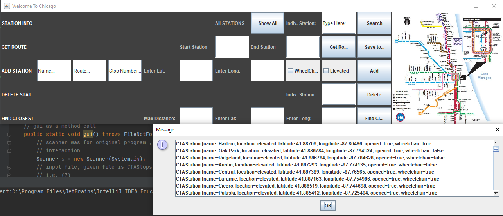

# Chicago Metro Java

## About
This project was created for a Java assignment at the Illinois Institute of Tecnology

## Expected Behavior

### How to Run
You are able to either run a console version from CTAMain or use the gui like above, gui.main().  The options should present a listbox in most cases reponding to the user selections.
Above, the listbox is responding to "Show All."

### Issues
If you happen to have issues running the program, it may be due to dependency/sdk.  This was 1.8, but the image is opened in JetBrains in 2020 with 14 and a couple quick recommendations
resolved the issue. 
